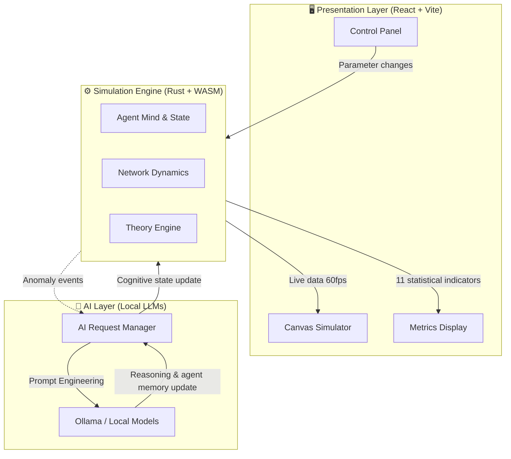
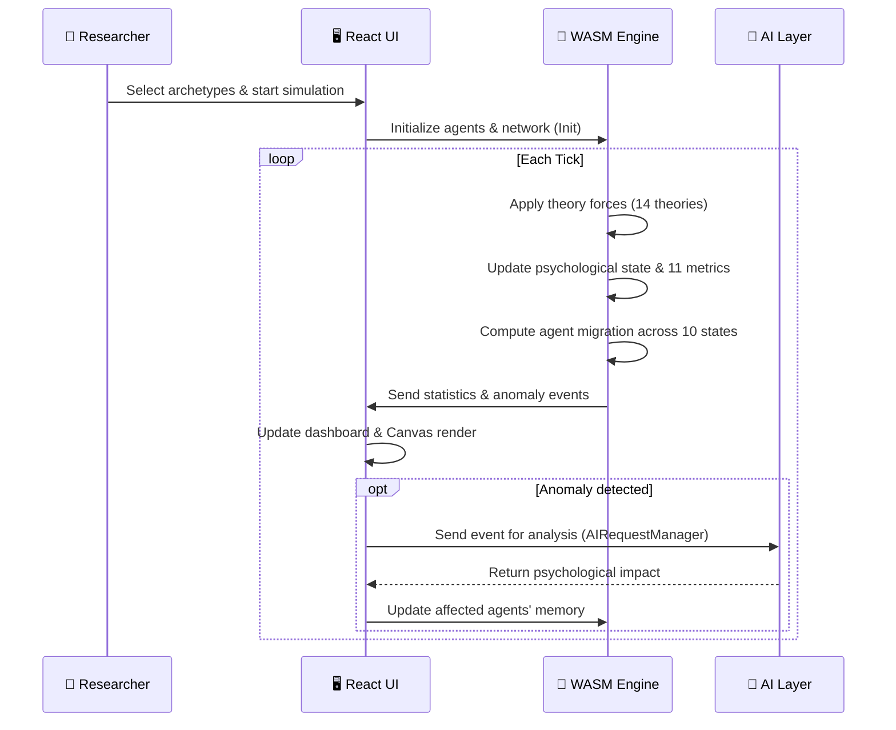
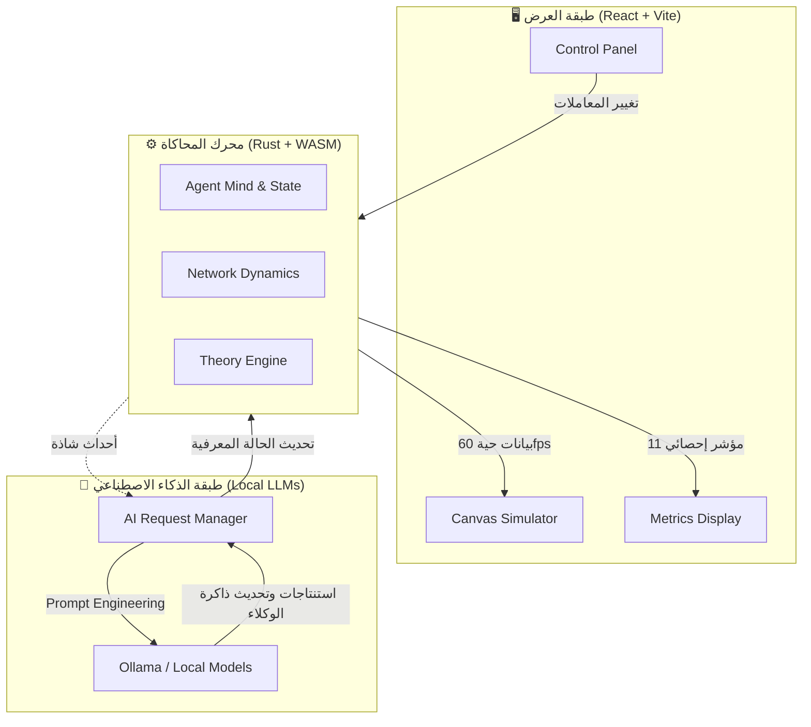

<!-- Language selector -->
<div align="center">

**🌐 Read this document in:** &nbsp;
[**English**](#-soft-power-lab) &nbsp;|&nbsp;
[**العربية**](#-مختبر-القوة-الناعمة-soft-power-lab)

---

</div>

---

# 🧪 Soft Power Lab

> **An advanced research platform for simulating complex social systems (Agent-Based Modeling) — studying soft power, cultural dynamics, societal polarization, and media influence.**

Soft Power Lab is built for researchers in sociology, political science, and data engineering. The goal is to simulate **"how societies evolve under competing pressures"** rather than simply modeling who wins.

---

## 🌟 Core Features

- **High-Performance Engine:** Built with `Rust` + `WebAssembly`, capable of simulating up to **10,000 agents** in real time at 60 fps.
- **AI Reasoning Layer:** Direct integration with `Ollama` (local LLMs) — agents can think, reason, and update their beliefs based on anomalous events.
- **Rigorous Theoretical Foundations:** 14 sociological theories, each mathematically weighted, covering contagion, radicalization, hegemony, and more.
- **Universal Archetype System:** 30+ agent archetypes across 6 global categories with unique psychological profiles.
- **Multilingual Interface:** Full support for 9 languages (English, Arabic, German, Portuguese, Persian, Russian, Turkish, Chinese, Hindi).
- **Academic Report Generation:** AI-powered academic report with SVG charts, metric cards, and export to JSON / CSV / PDF.

---

## 🏗️ System Architecture

The system is split into three tightly coupled layers:



### Technology Stack

| Layer | Technology | Purpose |
|-------|-----------|---------|
| **Core Engine** | Rust | Speed, memory safety, WASM compilation |
| **Bridge** | WebAssembly (wasm-bindgen) | Near-native performance in the browser |
| **Frontend** | React 18 + TypeScript | Complex, reactive UI management |
| **Rendering** | HTML5 Canvas 2D | 60 fps agent network visualization |
| **AI** | Ollama API / Fetch | Local LLM reasoning for agents |

---

## ⚙️ How the Simulation Works

The simulation runs in discrete **Ticks** (time steps). Each tick:



Each agent carries a **psychological matrix** including:
`Openness`, `Skepticism`, `Tribalism`, `Susceptibility`, `Resilience`, `AttentionSpan`

These parameters determine how each agent reacts to incoming messages, social pressure, and external events.

---

## 📐 The 14 Sociological Theories

Each theory applies a distinct mathematical force to the simulation each tick. Theories can be combined for complex emergent scenarios.

| # | Theory | Key Affected Metrics | Best Used When |
|---|--------|---------------------|---------------|
| 1 | **Network Contagion** | `memetic_velocity`, `echo_density` | Studying idea spread through social ties (family, tribes). The default foundation for any ABM. |
| 2 | **Echo Chamber** | `echo_density`, `polarization` | Studying information closure & extremism from exposure to homogeneous sources only. |
| 3 | **Radicalization Pathway** | `polarization`, `narrative_volatility` | Tracking a gradual shift from moderate to extremist. Requires pre-frustrated & isolated agents. |
| 4 | **Spiral of Silence** | `echo_density`, `cohesion` | Studying disappearance of minority opinions under social pressure in tribal/religious contexts. |
| 5 | **Memetic Diffusion** | `memetic_velocity`, `narrative_volatility` | Viral content spread (images, videos, slogans) — best with young-agent populations. |
| 6 | **Soft Power** | `elite_dominance`, `cohesion` | Studying cultural/media attraction from external sources (satellite channels, foreign content). |
| 7 | **Cultural Hegemony** | `ideological_entropy`, `echo_density` | Studying how dominant discourse becomes normalized. Best for religious/tribal institutional study. |
| 8 | **Diffusion of Innovations** | `memetic_velocity`, `cohesion` | Tracking how new ideas/behaviors spread through phases: innovators → early adopters → majority. |
| 9 | **Social Identity Theory** | `polarization`, `identity_fragmentation` | Studying in-group/out-group formation and its effect on discrimination and tribalism. |
| 10 | **Manufacturing Consent** | `elite_dominance`, `algorithmic_capture` | Studying directed media's role in shaping public opinion for elite interests. |
| 11 | **Agenda Setting** | `narrative_volatility`, `memetic_velocity` | Studying how media determines *what* people think about (not *how* they think). |
| 12 | **Prestige-Biased Transmission** | `elite_dominance`, `cohesion` | Studying how people emulate high-status individuals (religious leaders, celebrities, scholars). |
| 13 | **Attention Economy** | `algorithmic_capture`, `belief_adoption` | Studying competition for limited attention & information overload fatigue. |
| 14 | **Algorithmic Amplification** | `algorithmic_capture`, `polarization` | Studying how platform algorithms amplify controversial content over time. |

### Theory Incompatibilities

Some theories produce contradictory forces and should not be combined:
- `Radicalization` ↔ `Soft Power` or `Prestige Influence`
- `Echo Chamber` ↔ `Diffusion of Innovations`
- `Spiral of Silence` ↔ `Diffusion of Innovations`

---

## 👥 Agent Archetype System

The simulated society is composed of **archetypes** selected by the researcher. The system includes **30+ globally validated archetypes** across 6 categories:

| Category | Description | Example Archetypes |
|----------|-------------|-------------------|
| 📚 **Academic / Educational** | Knowledge producers & consumers | University student, Academic professor, Independent intellectual |
| ⛪ **Religious / Spiritual** | Spiritual authority, degrees of religiosity | Cleric, Moderate believer, Religious hardliner |
| 💼 **Economic / Professional** | Working classes & capital holders | Businessman, Government employee, Worker, Poor |
| 🏛 **Political / Civic** | Decision-makers & opposition | Professional politician, Rights activist, Community leader |
| 📱 **Media / Digital** | Information flow controllers | Journalist, Digital influencer, Content creator |
| 🌍 **Ideological** | Intellectual & doctrinal orientations | Liberal, Conservative, Leftist, Nationalist |

---

## 📊 Simulation Metrics (11 Indicators)

| Metric | Range | Meaning |
|--------|-------|---------|
| **Polarization Index** | 0.0 – 1.0 | Degree of societal division |
| **Cohesion Score** | 0.0 – 1.0 | Social unity strength |
| **Echo Chamber Density** | 0.0 – 1.0 | Information bubble isolation |
| **Narrative Volatility** | 0.0 – 1.0 | Rate of dominant belief change |
| **Elite Dominance** | 0.0 – 1.0 | Concentration of influence in elites |
| **Resistance Strength** | 0.0 – 1.0 | Capacity to resist external influence |
| **Memetic Velocity** | 0.0 – 1.0 | Speed of idea/meme spread |
| **Algorithmic Capture** | 0.0 – 1.0 | Platform algorithm control over beliefs |
| **Identity Fragmentation** | 0.0 – 1.0 | Breakdown of shared identity |
| **Gini Coefficient** | 0.0 – 1.0 | Influence inequality across agents |
| **Shannon Entropy** | 0.0 – 1.0 | Ideological diversity |
| **Health Score** | 0.0 – 1.0 | Overall societal stability index |

---

## 🛠️ Prerequisites

| Requirement | Version | Notes |
|-------------|---------|-------|
| **Node.js** | 18+ | Required |
| **npm** | 9+ | Required |
| **Rust + Cargo** | latest | Optional (for WASM engine build) |
| **wasm-pack** | latest | Optional (for WASM engine build) |
| **Ollama** | latest | Optional (for local AI reasoning) |

---

## 🚀 Quick Start

### Option 1 — Frontend Only (JS Fallback Engine)

Run the UI immediately without compiling the Rust engine:

```bash
cd apps/web-client
npm install
npm run dev
```

Open your browser at `http://localhost:3001`

### Option 2 — Full Build (High-Performance WASM Engine)

For maximum performance supporting up to 10,000 agents:

```bash
# Build the Rust engine
cd engine
cargo build --release --target wasm32-unknown-unknown
wasm-bindgen target/wasm32-unknown-unknown/release/soft_power_engine.wasm \
  --out-dir ../apps/web-client/public/wasm --target web

# Run the frontend
cd ../apps/web-client
npm install
npm run dev
```

### Option 3 — Enable AI Reasoning (Ollama)

To enable agents to "think" deeply about events:

1. Install [Ollama](https://ollama.ai/).
2. Pull a model:
   ```bash
   ollama run llama3
   ```
3. In the Web Client, enable advanced AI simulation and set the Ollama URL (default: `http://localhost:11434`).

---

## 📚 License

This project is intended for **research and academic purposes**.

---
---

<div dir="rtl" align="right">

# 🧪 مختبر القوة الناعمة (Soft Power Lab)

> **منصة بحثية متقدمة لمحاكاة النظم الاجتماعية المعقدة (Agent-Based Modeling) لدراسة القوة الناعمة، الديناميكيات الثقافية، الاستقطاب المجتمعي، وتأثير الإعلام.**

تم تصميم هذا النظام للباحثين في علم الاجتماع، العلوم السياسية، وهندسة البيانات. يهدف النظام إلى محاكاة **"كيف تتطور المجتمعات تحت الضغوط المتنافسة"** بدلاً من الاكتفاء بمحاكاة من ينتصر في النهاية.

---

## 🌟 الميزات الرئيسية

- **محرك عالي الأداء:** مبني باستخدام `Rust` و `WebAssembly` قادر على محاكاة حتى 10,000 وكيل في الوقت الفعلي بـ 60 إطار/ثانية.
- **طبقة الذكاء الاصطناعي:** تكامل مع `Ollama` والنماذج المحلية لتحليل الأحداث وتوليد استنتاجات منطقية للوكلاء.
- **أسس نظرية متينة:** 14 نظرية سوسيولوجية ذات وزن رياضي دقيق — من العدوى الشبكية إلى التضخيم الخوارزمي.
- **تصنيف شامل للوكلاء:** أكثر من 30 نمطاً عالمياً موزعاً على 6 فئات رئيسية، كل وكيل يمتلك مصفوفة نفسية فريدة.
- **واجهة متعددة اللغات:** دعم كامل لـ 9 لغات.
- **تقرير أكاديمي بالذكاء الاصطناعي:** ملخص أكاديمي مُولَّد بالذكاء الاصطناعي مع رسوم SVG وتصدير JSON / CSV / PDF.

---

## 🏗️ الهيكلية المعمارية للنظام

النظام مقسم إلى ثلاث طبقات رئيسية:



---

## ⚙️ آلية العمل (Ticks)

تعمل المحاكاة بنظام الحلقات الزمنية (Ticks). في كل دورة:

1. **تطبيق قوى النظريات الـ 14** على شبكة الوكلاء
2. **تحديث المصفوفة النفسية** لكل وكيل
3. **حساب هجرة الوكلاء** بين الحالات الـ 10 (معتدل، متطرف، محافظ...)
4. **إرسال الإحصائيات** و**الأحداث الشاذة** للواجهة
5. في حال وجود حدث شاذ: **إرسال الحدث للذكاء الاصطناعي** الذي يعيد تشكيل ذاكرة الوكلاء المتأثرين

كل وكيل يمتلك **مصفوفة نفسية** تشمل:
`الانفتاح (Openness)`، `التشكيك (Skepticism)`، `القبلية (Tribalism)`، `القابلية للتأثر (Susceptibility)`، `المرونة (Resilience)`، `مدى الانتباه (AttentionSpan)`

---

## 📐 النظريات الـ 14 المُدمجة في المحاكاة

كل نظرية تُطبّق قوة رياضية مختلفة على الوكلاء في كل دورة. يمكن تفعيل عدة نظريات معاً لخلق سيناريوهات معقدة.

| # | النظرية | المقاييس المتأثرة | متى تُستخدم؟ |
|---|---------|-----------------|-------------|
| 1 | **العدوى الشبكية** Network Contagion | `memetic_velocity`، `echo_density` | دراسة انتشار الأفكار عبر العلاقات الاجتماعية. القاعدة الأساسية لأي محاكاة ABM. |
| 2 | **غرفة الصدى** Echo Chamber | `echo_density`، `polarization` | دراسة الانغلاق المعلوماتي والتطرف الناتج عن التعرض لمصادر متماثلة فقط. |
| 3 | **التطرف التدريجي** Radicalization Pathway | `polarization`، `narrative_volatility` | تتبع التحول من معتدل إلى متطرف عبر مراحل. تستلزم وكلاء محبطين ومنعزلين. |
| 4 | **دوامة الصمت** Spiral of Silence | `echo_density`، `cohesion` | دراسة اختفاء الآراء الأقلية تحت الضغط الاجتماعي. مناسبة للمجتمعات القبلية والدينية. |
| 5 | **انتشار الميمات** Memetic Diffusion | `memetic_velocity`، `narrative_volatility` | دراسة انتشار المحتوى الفيروسي (صور، فيديوهات، شعارات). الأنسب مع الوكلاء الشباب. |
| 6 | **القوة الناعمة** Soft Power | `elite_dominance`، `cohesion` | دراسة تأثير الجذب الثقافي الخارجي (قنوات فضائية، محتوى أجنبي). |
| 7 | **الهيمنة الثقافية** Cultural Hegemony | `ideological_entropy`، `echo_density` | دراسة تطبيع الخطاب السائد. مناسبة لتأثير المؤسسات الدينية والقبلية. |
| 8 | **انتشار الأفكار الجديدة** Diffusion of Innovations | `memetic_velocity`، `cohesion` | تتبع انتشار أفكار جديدة: مبتكرون ← متبنون مبكرون ← أغلبية. |
| 9 | **الهوية الاجتماعية** Social Identity Theory | `polarization`، `identity_fragmentation` | دراسة تشكّل مجموعات "نحن/هم" وتأثيرها على التمييز والطائفية. |
| 10 | **تصنيع الموافقة** Manufacturing Consent | `elite_dominance`، `algorithmic_capture` | دراسة دور الإعلام الموجَّه في تشكيل رأي عام يخدم مصالح النخب. |
| 11 | **تحديد الأجندة** Agenda Setting | `narrative_volatility`، `memetic_velocity` | دراسة كيف تُحدد وسائل الإعلام *ما* يُفكر فيه الناس (لا *كيف* يفكرون). |
| 12 | **تأثير المكانة** Prestige-Biased Transmission | `elite_dominance`، `cohesion` | دراسة اقتداء الناس بالأفراد ذوي المكانة (شيوخ، مثقفون، مشاهير). |
| 13 | **اقتصاد الانتباه** Attention Economy | `algorithmic_capture`، `belief_adoption` | دراسة التنافس على الانتباه المحدود وأثر الإجهاد المعلوماتي. |
| 14 | **التضخيم الخوارزمي** Algorithmic Amplification | `algorithmic_capture`، `polarization` | دراسة كيف تُضخّم خوارزميات المنصات المحتوى المثير للجدل تدريجياً. |

### ⚠️ تعارضات النظريات

بعض النظريات تُنتج قوى متضاربة ولا يُنصح بتفعيلها معاً:
- `التطرف التدريجي` ↔ `القوة الناعمة` أو `تأثير المكانة`
- `غرفة الصدى` ↔ `انتشار الأفكار الجديدة`
- `دوامة الصمت` ↔ `انتشار الأفكار الجديدة`

---

## 👥 نظام تصنيف الوكلاء (Archetypes)

| الفئة | الوصف | أمثلة على الأنماط |
|-------|-------|-----------------|
| 📚 **أكاديمي/تعليمي** | منتجو ومستهلكو المعرفة | طالب جامعي، أستاذ أكاديمي، مثقف مستقل |
| ⛪ **ديني/روحاني** | السلطة الروحية ودرجات التدين | رجل دين، متدين معتدل، متشدد ديني |
| 💼 **اقتصادي/مهني** | الطبقات العاملة وأصحاب المال | رجل أعمال، موظف حكومي، عامل، فقير |
| 🏛 **سياسي/مدني** | صناع القرار والمعارضون | سياسي محترف، ناشط حقوقي، زعيم مجتمعي |
| 📱 **إعلامي/رقمي** | متحكمو تدفق المعلومات | صحفي، مؤثر رقمي، منتج محتوى |
| 🌍 **أيديولوجي** | التوجهات الفكرية والعقائدية | ليبرالي، محافظ، يساري، قومي |

---

## 📊 مؤشرات المحاكاة الـ 11

| المؤشر | النطاق | الدلالة |
|--------|--------|--------|
| **مؤشر الاستقطاب** | 0.0 – 1.0 | درجة الانقسام المجتمعي |
| **درجة التماسك** | 0.0 – 1.0 | قوة الوحدة الاجتماعية |
| **كثافة غرف الصدى** | 0.0 – 1.0 | درجة الانعزال المعلوماتي |
| **تقلب السرديات** | 0.0 – 1.0 | معدل تغيّر المعتقد السائد |
| **هيمنة النخبة** | 0.0 – 1.0 | تمركز التأثير في النخب |
| **قوة المقاومة** | 0.0 – 1.0 | القدرة على مقاومة التأثير الخارجي |
| **سرعة انتشار الميمات** | 0.0 – 1.0 | سرعة انتشار الأفكار |
| **الاستحواذ الخوارزمي** | 0.0 – 1.0 | هيمنة خوارزميات المنصات على المعتقدات |
| **تفكك الهوية** | 0.0 – 1.0 | انهيار الهوية المشتركة |
| **معامل جيني** | 0.0 – 1.0 | عدم مساواة التأثير بين الوكلاء |
| **إنتروبيا شانون** | 0.0 – 1.0 | التنوع الأيديولوجي |
| **مؤشر الصحة المجتمعية** | 0.0 – 1.0 | مؤشر الاستقرار العام |

---

## 🛠️ متطلبات التشغيل

| المتطلب | الإصدار | ملاحظة |
|---------|---------|--------|
| **Node.js** | 18+ | مطلوب |
| **npm** | 9+ | مطلوب |
| **Rust + Cargo** | latest | اختياري (لبناء محرك WASM) |
| **wasm-pack** | latest | اختياري (لبناء محرك WASM) |
| **Ollama** | latest | اختياري (للذكاء الاصطناعي المحلي) |

---

## 🚀 خطوات التشغيل

### الخيار 1 — الواجهة فقط (محرك JS البديل)

```bash
cd apps/web-client
npm install
npm run dev
```
افتح المتصفح على `http://localhost:3001`

### الخيار 2 — البناء الكامل (محرك WASM عالي الأداء)

```bash
# بناء محرك Rust
cd engine
cargo build --release --target wasm32-unknown-unknown
wasm-bindgen target/wasm32-unknown-unknown/release/soft_power_engine.wasm \
  --out-dir ../apps/web-client/public/wasm --target web

# تشغيل الواجهة
cd ../apps/web-client
npm install
npm run dev
```

### الخيار 3 — تفعيل الذكاء الاصطناعي (Ollama)

```bash
ollama run llama3
```
ثم في واجهة المشروع: فعّل خيار الذكاء الاصطناعي وحدد العنوان `http://localhost:11434`.

---

## 📚 رخصة الاستخدام

هذا المشروع مخصص للأغراض البحثية والأكاديمية.

</div>
